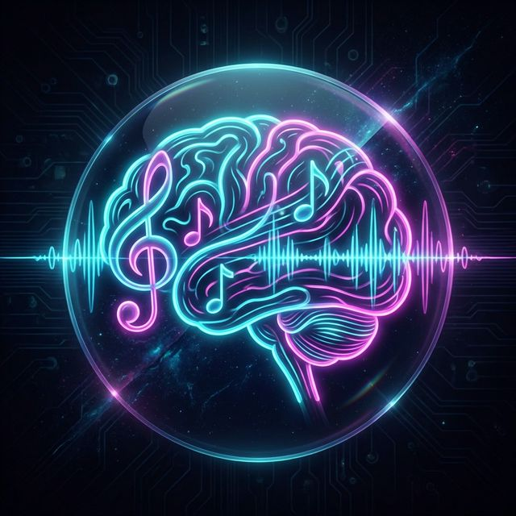

# 🎵 Gandharva - The AI Music Studio



**Bridging the gap between raw audio and structured musical data.** Gandharva is an intelligent transcription platform that transforms your melodies into digital reality.

---

## 1. The Real-World Problem
Imagine a musician who has a melody in their head or just hummed into a recording on their phone. They have the "soul" of a song, but they don't know how to write sheet music or create professional MIDI files to use in a studio. 

For most people, turning sound into notes requires years of expensive ear training and music theory. Hiring a professional transcriber is often slow and costs more than an independent artist can afford. This technical wall stops thousands of great songs from ever being produced.

**Gandharva was built to tear down that wall.**

---

## 2. The Solution: Enter Gandharva
Gandharva acts as an **"AI Translator"** for sound. 

You upload an MP3 or WAV file, and the AI "listens" to the complex frequencies, calculates the exact notes, chords, and beats, and gives you back the digital building blocks (MIDI, data) to use in music software. Whether it's a simple whistled tune or a recording of a piano, Gandharva decodes the music so you can focus on the craft of creation.

---

## 3. How It Works: The Journey of an Audio File
To make this magic happen, every file goes through a three-stage professional pipeline:

*   **Step 1: The Storefront (Frontend)**: The user interacts with our Next.js website (hosted on Netlify). When they log in, **Firebase** acts like a security guard, verifying their identity and keeping their musical library private and secure.
*   **Step 2: The Brain (Backend)**: The audio file is sent to our AI factory—a **FastAPI** server running on **Hugging Face**. Here, specialized Machine Learning models analyze the literal waves of the sound, turning vibrations into math, and math into musical notation.
*   **Step 3: The Vault (Database)**: Once analyzed, the results are safely locked away in **Firebase Firestore**. This data is tied specifically to the user's account, so their compositions are always there whenever they log back in.

---

## 4. The API: How Machines Talk to Each Other
Imagine a busy restaurant. 
*   The **Customer** (the Frontend website) wants a "Transcribed Song."
*   The **Kitchen** (the AI Backend) knows how to cook that song.
*   The **Waiter** is the **API** (Application Programming Interface). 

The website doesn't need to know *how* the kitchen works; it just hands the order (the audio file) to the Waiter (the API). The Waiter takes it to the kitchen, waits for it to be ready, and brings the finished musical data back to the customer.

### Core Endpoints:
Developers can interact with our "Brain" directly through these paths:
*   `POST /api/v1/auth/register` & `/login`: Secures user sessions and manages access.
*   `POST /api/v1/audio/analyze`: The "Chef's Special." This is where raw audio goes in, and precise musical data (BPM, Notes, Confidence) comes out.

> [!TIP]
> Because we built this using an API-first approach, someone could theoretically build an iPhone app, an Android app, or even a hardware plugin tomorrow and plug it into our existing "Brain" without changing a single line of backend code.

---

## 5. The Tech Stack
*   **Frontend**: [Next.js](https://nextjs.org/) (React) deployed on **Netlify**. Chosen for its lightning-fast speed and the ability to build a beautiful, modern interface that musicians love.
*   **Backend**: [FastAPI](https://fastapi.tiangolo.com/) & [Gradio](https://gradio.app/) deployed on **Hugging Face Spaces**. Chosen because Hugging Face provides massive computing power specifically meant for heavy AI and signal-processing math.
*   **Database/Auth**: [Firebase](https://firebase.google.com/) (Project: `gandharva-2026`). Chosen for enterprise-grade security and the ability to store and sync user data in real-time.

---

## 6. Advanced Engineering
Building an AI studio isn't just about the "big pieces." It's about solving the small, complex technical hurdles:

### Denoiser++
Cloud environments often mangle complex text data when you paste it into their settings. We built **Denoiser++**, a custom Python script that cleans up messy formatting (like unquoted JSON keys) automatically. It ensures our server never crashes just because a configuration key was missing a quote.

### API Path Routing Priority
To keep the backend running smoothly, we had to ensure our API never got blocked by the visual dashboard. We specifically "mounted" the FastAPI engine to `/api/v1` *before* the dashboard. This ensures that when a machine sends a file for analysis, the server answers immediately instead of getting confused by the user interface.

---

## 7. Environment Setup & Security
### .env.example
> [!IMPORTANT]
> **Security First**: Never share or hardcode your real API keys. Use placeholders like the ones below.

| Variable | Description | Placeholder Value |
| :--- | :--- | :--- |
| `NEXT_PUBLIC_API_URL` | Production Backend URL | `https://your-api-link.hf.space` |
| `FIREBASE_SERVICE_ACCOUNT_JSON` | Backend Admin Secret | `{"type": "service_account", ...}` |
| `NEXT_PUBLIC_FIREBASE_API_KEY` | Frontend API Key | `your-web-key-here` |

### Commands to Run Locally
**Backend**:
```bash
cd backend
python app.py
```
**Frontend**:
```bash
cd frontend
npm run dev
```

---

## 8. Inspiration & Call to Action
You don't need to be a math genius to build with Artificial Intelligence. By learning how to connect the right tools—like **Next.js**, **FastAPI**, and **Firebase**—you can solve real-world problems and help people create art.

**Fork this repo, explore the code, and build your own magic!** 🚀
